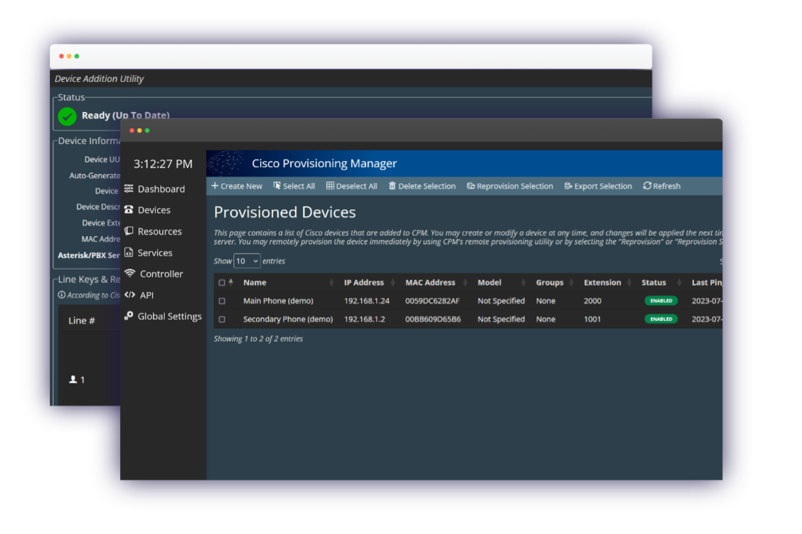

<h1 align="center" style="text-align: center;">Cisco Provisioning Manager 0.0.1a</h1>

A lightweight Node.JS management provisioning server + Webadmin Panel for Cisco Device Configurations.  
  Intended for Cisco Devices with <b>Enterprise Firmware</b> running the <a href="https://github.com/usecallmanagernz/patches">UseCallManager</a> patch.

<h3 align="center" style="text-align: center">Overview</h3>

Cisco Provisioning Manager (CPM) is a cutting-edge open-source solution designed to revolutionize the management and remote control of multiple Cisco Phones from a single workstation. It offers a highly efficient HTTP provisioning system for Cisco endpoints, making it easier than ever to handle device configurations.

> [!TIP]
> If you are encountering an error with ``bcrypt`` when starting the application, the error is NOT a problem with this repo's code. Please cleanly reinstall bCrypt before trying again.
>
> ## Need Help?
> 
>
> ## [Create a Free Support Ticket](https://ticketcloud.wriar.org/index.php)

## Features
- **Built-In HTTP Server:** Enjoy a seamless plug-and-play replacement for traditional slow TFTP software (TFTPd, etc), streamlining your provisioning process.

- **Secure WebAdmin Panel:** Access all your phones and provisioned devices from one convenient location. Create and publish new configuration files on-demand through our secure online user interface.

- **Portability:** CPM stores all data in the ``/data`` folder, making it easy to clone CPM instances by copying the data folder.

- **Performance Based:** CPM Uses a unique JSON storage system with a custom cache, making data queries quicker and reducing application memory use.

- **Device Remote Control:** Enable full remote-control reprovisioning of devices, removing the need to manually reset device information.

- **Cisco CUCM Authserver Replacement:** Say goodbye to the limitations of Cisco CUCM. CPM allows you to deploy custom applications, alerts, and messaging directly to targeted Cisco Phones, no CUCM required.

- **Robust API Support:** Seamlessly integrate CPM with your custom third-party applications through our optional REST API.

## Getting Started
1. **Configure Environment:** Set up your `.env` file and generate a secure session key as well as a purge secret. 

2. **Install NPM Modules**: Run ``npm install``.
4. **Start Server:** Run ``node src/server.js`` for production environments. For development environments, run ``npm run a`` and ``npm run b`` to run ``nodemon`` and ``sass`` parser concurrently.

2. **Log In:** Navigate to `localhost:6970/login` and user the default credentials ``admin``, ``admin``.

3. **Setup Credentials (Optional):** The admin/admin login may be changed by creating a new account JSON object in ``src/data/data.json``. A bcrypt hash may be used by setting ``peEnable`` to true. Otherwise, a plaintext password may be used.

## Adding a device:
1. Login to the CPM administration interface on ``localhost:6970/login``.
2. Select the 'Devices' tab
3. Select 'Create New Device'
4. Create the device first in your PBX, then add its details here.
5. Manually reprovision the device

Note: fully new devices must be reprovisioned manually first. 

## Current WIP Features:
Note that the following features are work-in-progress and may be unavailable:
- Device Deletion
- RM Control
- Backgrounds, Ringtones, Groups

## How to Contribute
We welcome contributions from the community to make CPM even better. If you'd like to contribute, feel free to fork this repository and add new commits.

## License
CPM is open-source and available under the **MIT LICENSE** specified under the LICENSE.MD file. If packages licensed under the GNU GPL license is used, such use constitutes a modification by the "END USER". The inclusion of GNU GPL software is not included in this software or releases; an instruction (pointer) to such use is specified in ``package.json`` (no modified source code from GNU GPL licenses are included). If distribution with compiled GNU GPL packages in source code/binaries are completed by the "END USER", the modified source code by the "END USER" must relicensed in a seperate codebase under GNU GPL. The developer of this application is not associated nor responsible for such distributions; such distributions have no association with the codebase in the current repository.

---

**Disclaimer:** Cisco Provisioning Manager is an independent project and is not affiliated with or endorsed by Cisco Systems, Inc. Cisco and Cisco logos are trademarks or registered trademarks of Cisco Systems, Inc. This system is intended only for use in small or testing environments.
